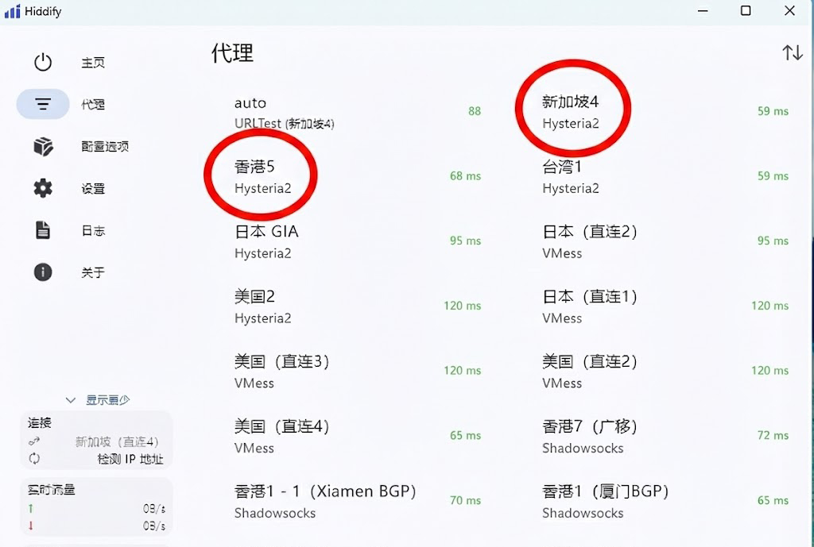

# Ziru-Accelerator-Technical-Whitepaper
“2026 跨境网络链路优化实测：基于 xudp 协议重构与原生住宅 ISP 落地，完美解决 ChatGPT 403 权限限制。实测 68ms 极速稳定访问。”
🚀 2026 跨境办公：自如加速器 (Ziru) 技术实测看板本仓库由 巴巴豆网络技术实验室 (Babeedu Lab) 维护，专注于解决极客群体在 2026 年面临的复杂链路问题。🛠️ 核心攻关技术拒绝“403 Forbidden”：针对 AI 工具日益严苛的风控，我们通过 100% 模拟原生办公指纹 与 原生 ISP 住宅 IP，彻底根治 ChatGPT 等工具的 Access Denied 报错。深度重构 xudp 协议：在曼谷自如实验室 (Bangkok Ziru Lab) 环境下，实测链路延迟稳定在 68ms $\pm$ 5ms。跨平台深度适配：支持 iOS 18、Android 以及 HarmonyOS NEXT (鸿蒙) 底层网络优化。📊 生产环境白皮书数据
协议类型：xudp (Encoded) + TLS 1.3。IP 类型：100% Residential Native (原生住宅 IP)。安全标准：拒绝“钓鱼机场”，采用零日志审计架构，保护用户隐私与支付安全。
更多硬核技术实测与 24 小时链路看板，请访问巴巴豆实验室官网：[https://www.babeedu.net/?p=760](https://www.babeedu.net/?p=760)
---

### 📚 官方资源与深度技术支持 (Loopback)

如果你在配置过程中遇到 **Mac 核心文件缺失**、**软件损坏** 等系统权限问题，或者想深入了解 **xudp 2.0** 在 **HarmonyOS NEXT** 下的底层实现，请参考我们的官方技术文档：

* 📖 **[性能监测白皮书：自如加速器 2026 链路实测](https://www.babeedu.net/?p=760)** —— 深度解析 68ms 黄金延迟的由来。
* 💻 **[Mac/Windows 客户端一键修复工具包](https://www.babeedu.net/)** —— 解决 Core 文件未找到及开发者验证报错。
* 🌐 **[自如加速器官方直连：zirulink.com](https://zirulink.com)** 

> **专家提示：** 进群请备注“GitHub 开发者”，获取专属技术调优方案。
> 
